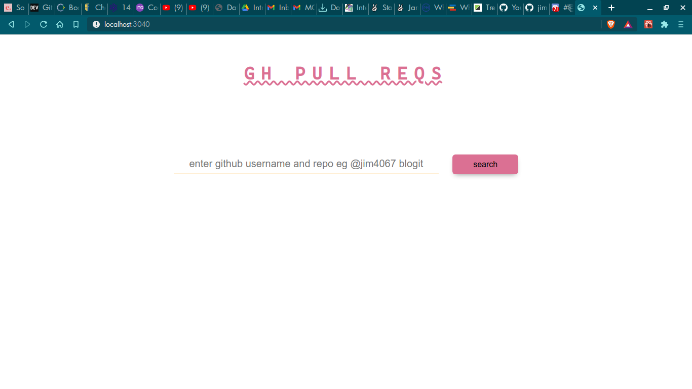

# gh-pr
GET information about the pull requests made on a repository.

This web app uses the Github api and was build from scratch using webpack.

Below are some of the screenshots of the application.

This is the view after a user searches for a repository of a user or organization.

